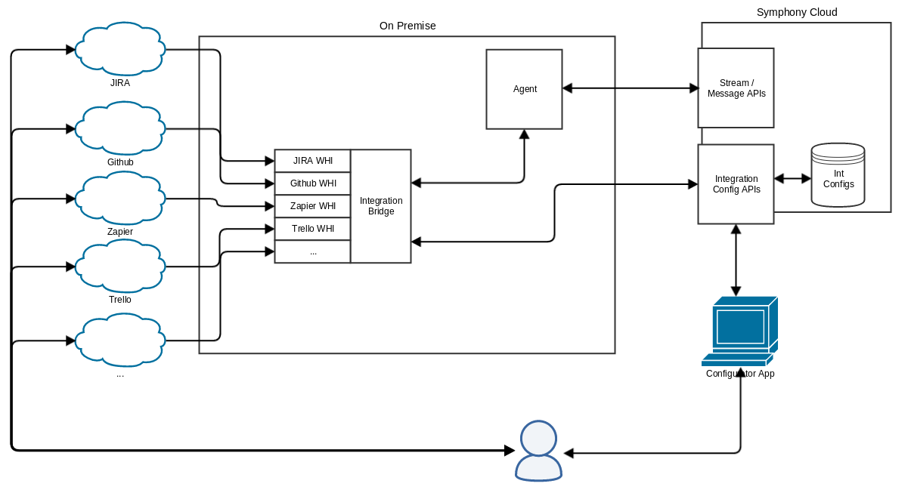

# Integration Quickstart Guide

This document aims to allow developers to create their first integration using the Integration Bridge.

The quickstart guide covers: 

* Integration Bridge architecture
* Webhook Integration architecture
* Build instructions for the Java developer, using Intellij or Maven
* Application healthcheck
* YAML configuration file
* How to build a new integration, and validate it using PostMan
* How to build a new Configurator APP
* How to inspect incoming payloads
* Overview about MessageML v2

## Integration Bridge architecture
Integration Bridge is responsible for managing active integrations and provides key services to allow third party services the ability to post messages into a configurable set of streams

The key services provided to the registered integrations are:

* Authentication proxy - each integration should be configured with credentials, but the implementation never needs to
 deal with them. Once bootstrapped, the integration can use integration bridge services as if it's unauthenticated. The bridge itself proxies those services to the cloud with the proper authentication.
* Send messages to a stream
* Read and write configuration information to the cloud configuration services
* Read user information to the cloud user services
* Health check

### Definitions

A list of definitions also serves to introduce the main components of the integrations system.

* **Integration** - An interface to be implemented by an specific integration. These are bootstrapped into the
Integration Bridge via config file. They have a lifecycle to be managed by the Integration Bridge.

* **Webhook Integration** - A specific type of integration which can be configured to listen for specific webhook events
 from external services. This is also a superclass of particular implementations of the webhook integrations which support specific services.
 For instance, a Zapier webhook integration would extend this, and provide logic to translate the event information
 into a particular message to the streams.

* **Integration Config API** - Cloud API responsible to manage the webhook instances configured by the user.

* **Configurator** - An application (listed in the Symphony App Store) which allows a user to
configure instances of an integration type. Using Zapier as an example, an user would have the configuration app
available in the app store, and once opened would be able to configure a new instance of the Zapier webhook
integration, get the URL for the JIRA cloud services to ping with webhook events, configure streams which the
integration instance should post to, as well as the name of the instance. The configurator app can also be used to
manage existing instances.

### System overview
Following below how the message sent by third party services flows through the system overall.



The message sent by the third party service is processed by the integration parser and translated to MessageML. After that, the Integration Bridge posts the result MessageML through the Agent Message API's.

## Webhook Integration architecture
In this section we'll detail what is the general workflow when the core receives a message from an integrated
application, let's say Zapier, for this example:

> 1. Expose an endpoint where it will receive the message.
> 2. Identify where this message is coming from through the URL parameters it received (configurationId and instanceId)
> 3. If the message is trying to reach a valid integration and a configured instance, it will delegate the message to the specific integration code implemented separately across the other Integration repositories.
> 4. The integration Zapier logic will now determine which event it is dealing with through the received message header parameter, and based on this will determine which [parser](#parsers) it must use to treat the message properly.
> 5. The parser will then convert the message to a [Message ML format](#the-message-ml-format), extracting the needed information from the payload received.
> 6. The parsed message will return to the Integration Core and post the message to the Symphony platform

### Parsers
Integrations will most of the times need a parser to work properly.
Those special classes will need to deal with the content coming from the related application, parsing this data into a format readable by the Symphony platform.

This format is called Symphony Message ML and it may contain a set of tags. More details below.

### The Message ML format
A Message ML is a Symphony XML format that defines XML elements and attributes necessary to compose a message that can be posted within a chat room.
The most basic message one can send may be as simple as ``<messageML>simple message</messageML>`` or as detailed as it can get. What determines this is what system we are integrating with.

These elements and attributes will be briefly detailed in the next topics as reference. The specific integration formats can be found in their separate repositories "Readme" files.

### Entity (MessageMLv1.0)
_**note: MessageMLv1.0 has been superseded by MessageMLv2.0. MessageMLv1.0 is still supported, however MessageMLv2.0 will allow you to create a rich render in a more seamlessly manner, with less steps and no front end code. Please see a JIRA ticket rendered using messageMLv2.0 here for as a complex example: https://symphonyoss.atlassian.net/wiki/display/WGFOS/Single+Jira+Ticket+-+Templated+PresentationML & see [Zapier](https://github.com/symphonyoss/App-Integrations-Zapier) as a simple example of a richly rendererd message._**

An entity is a special element contained in a ``<messageML>``, it may also be nested within other entities as another element, and so on.

Entities must have a "type" and a "version", and may also have a "name" for itself, all of those as XML attributes.

The first entity in a messageML MUST have an element called "presentationML".

The ``<presentationML>`` is a special element that must hold all content that would be otherwise drawn on Symphony by other elements, represented as a single string on its content.
This particular text must follow the rules presented [here](https://rest-api.symphony.com/docs/message-format/).

It is important that it contains matching information as it is used for visualising a message when a specific renderer is not present, on Symphony mobile apps or content export.

Entities may also have ``<attribute>``s as their XML elements, which in turn must have a "name", a "type" and a "value" as attributes.

Here's an example of a valid MessageML, containing all of the mentioned above:

```xml
<messageML>
    <entity type="sample.event.core" version="1.0">
        <presentationML>test message for:<br/>application core</presentationML>
        <attribute name="message" type="org.symphonyoss.string" value="test message"/>
        <entity name="application" type="sample.application">
            <attribute name="appName" type="org.symphonyoss.string" value="core"/>
        </entity>
    </entity>
</messageML>
```

## Build instructions for the Java developer

### What you’ll build
You’ll build an integration module to be used with the [Integration Bridge](https://github.com/symphonyoss/App-Integrations-Core).

### What you’ll need
* JDK 1.8
* Maven 3.0.5+
* Node 6.10
* Gulp (globally installed)
* Webpack (globally installed)

### Build with maven
Integration Bridge is compatible with Apache Maven 3.0.5 or above. If you don’t already have Maven installed you can follow the instructions at [Maven Website](https://maven.apache.org).

To start from scratch, do the following:

1. Clone the source repository using Git: `git clone git@github.com:symphonyoss/App-Integrations-Zapier.git`
2. cd into App-Integrations-Zapier
3. Build using maven: `mvn clean install`

### Run locally

1. Create the 'certs' directory and put your application certificate over there
```
mkdir certs
cp $CERT_PATH/zapier.p12 certs/zapier.p12
```

2. Define your certificate file, password, and API endpoints in the environment shell script.
```
cp local-run/env.sh.sample env.sh
open env.sh
```

Make sure that
- Certificate filename and password are correct
- You can reach all Symphony Pod endpoints
- Service accounts exists and cert CNs match with account's usernames. **Note: The team is working on a integration-provisioning module that will automate this process; until further notice, please contact Symphony Support to get your Symphony integration deployed on your pod, as the pod will need an exact match of service account name, certs and app name in the pod for your app to be visible in your pod and usable. You will need to provide the (?)**
- `./env.sh`, `./application.yaml` and `./certs/` are ignored by Git and don't end up in any code repository

2. Run the integrations
```
./run.sh
```

This command will create an `application.yaml` file in the project root folder, using `local-run/application.yaml.template` as template.

## Expose local endpoint to a public host

In order to be able to create the app in the Foundation pod, you must provide a public `App Url`; you can use [ngrok](https://ngrok.com/) (or similar) to tunnel your local connection and expose it via a public DNS:
```
ngrok http 8080
```
Your local port 8080 is now accessible via `<dynamic_id>.ngrok.io`

If you have a paid subscription, you can also use
```
ngrok http -subdomain=my.static.subdomain 8080
```

## Add your locally running application to the Symphony Market

Adjust your [bundle.json](src/main/webapp/bundle.json) located src/main/webapp/ with the URL you are exposing via ngrok, the configuration and bot id's, and the application context.

**Note: The team is working on a integration-provisioning module that will automate this process; until further notice, please contact Symphony Support to get your configuration and bot id's.

For the application context, it should match what you have on [application-zapier.yml](src/main/resources/application-zapier.yml)

For instance, see apps/zapier present in the URL's for the controller.html and appstore-logo.png, as well as in the **context** query parameter for the controller:

```
{
  "applications": [
    {
      "type": "sandbox",
      "id": "devZapierWebHookIntegration",
      "name": "Zapier",
      "blurb": "Zapier Webhook Integration in Development Mode",
      "publisher": "Symphony",
      "url": "https://d74a790c.ngrok.io/apps/zapier/controller.html?configurationId=58598bf8e4b057438e69f517&botUserId=346621040656485&id=devZapierWebHookIntegration&context=apps/zapier",
      "icon": "https://d74a790c.ngrok.io/apps/zapier/img/appstore-logo.png",
      "domain": ".ngrok.io"
    }
  ]
}
```

Access the application icon on your browser to make sure it works and to accept any unsafe certificates (if necessary). In the above example, the URL to acces is https://d74a790c.ngrok.io/img/appstore-logo.png).

**Run your application again as indicated above, to get the new bundle.js information packaged.**

Launch the Symphony client on your browser, adding your bundle.js as path of the query parameters in the URL. For instance, using the Foundation Dev Pod with the above ngrok sample URL: https://foundation-dev.symphony.com?bundle=https://d74a790c.ngrok.io/apps/zapier/bundle.json.

Access the Symphony Market on the browser, and you should be notified to allow unauthorized apps. That is your development app added through bundle.json. Accept the notification and you should see your application in the application list, with the name and description provided in the bundle.json.

## Developing your own webhook configuration flow

The application added to the Symphony Market is commonly referred to as the "Configurator Application", as it allows the user to configure the webhooks for a 3rd party integration.

Zapier Configurator Application is based on the out-of-the-box flow provided by [App-Integrations-FE-Commons](https://github.com/symphonyoss/App-Integrations-FE-Commons), 
which includes a complete set of views that allow users to manage the webhooks for an integration. Zapier Configurator App implementation involves the following files, and it is based on the [out-of-the-box-configurator sample](https://github.com/symphonyoss/App-Integrations-FE-Commons/tree/dev/samples/out-of-the-box-configurator):

- [.babelrc](.babelrc)
- [.eslint](.eslint)
- [package.json](package.json)
- [webpack.config.js](webpack.config.js)
- [webpack.config.prod.js](webpack.config.prod.js)
- [src/main/webapp](src/main/webapp)

It is also possible to customize the views and flows for your Configurator App. Check the [posting-location sample](https://github.com/symphonyoss/App-Integrations-FE-Commons/tree/dev/samples/posting-location-sample)
for an example on how to do that.

### Running with Intellij
TODO

## Application healthcheck
To validate if your application were bootstrapped successfully you can reach on the application health check using
the URL http://localhost:8080/integration/health

The application health will indicate the connectivity and compatibility for each service you want to communicate like POD, Key Manager, and Agent. You also could check the application health, the configurator URL's, application flags, and latest posted message timestamp.

This is the result from healthcheck:

```
{
  "status": "UP",
  "message": "Success",
  "version": "0.13.0-SNAPSHOT",
  "services": {
    "Agent": {
      "connectivity": "UP",
      "currentVersion": "1.46.0",
      "minVersion": "1.44.0",
      "compatibility": "OK"
    },
    "POD": {
      "connectivity": "UP",
      "currentVersion": "1.46.0",
      "minVersion": "1.44.0",
      "compatibility": "OK"
    },
    "Key Manager": {
      "connectivity": "UP",
      "currentVersion": "1.46.0",
      "minVersion": "1.44.0",
      "compatibility": "OK"
    }
  },
  "applications": [
    {
      "name": "zapier",
      "version": "0.13.0-SNAPSHOT",
      "status": "ACTIVE",
      "message": "Success",
      "configurator": {
        "loadUrl": "https://d74a790c.ngrok.io/apps/zapier/controller.html",
        "iconUrl": "https://d74a790c.ngrok.io/apps/zapier/img/appstore-logo.png"
      },
      "flags": {
        "parser_installed": "OK",
        "configurator_installed": "OK",
        "certificate_installed": "OK",
        "user_authenticated": "OK"
      },
      "latestPostTimestamp": "2017-05-29T16:30:44Z-0300"
    }
  ]
}
```

## YAML Configuration File
TODO

## Build a new integration
TODO

## Build the Configurator APP
TODO

## Inspect incoming payloads
TODO

## MessageML v2
TODO