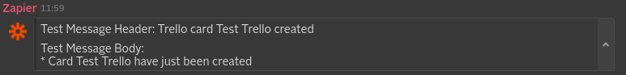

[](https://finosfoundation.atlassian.net/wiki/display/FINOS/Archived)
[](https://travis-ci.org/symphonyoss/App-Integrations-Zapier)
[](https://www.versioneye.com/user/projects/58d049f9dcaf9e0048399c74)
[](https://scan.coverity.com/projects/symphonyoss-app-integrations-zapier)
[](https://codecov.io/gh/symphonyoss/App-Integrations-Zapier)

*This readme contains information that both covers Zapier's specific webhook configuration. To see the development guide for Symphony Integrations, please go to to the [quick start guide](IntegrationQuickstartGuide.md).*

# Zapier WebHook Integration
The Zapier WebHook Integration will allow you to add an ecosystem of 600+ apps to the Symphony platform. Zapier sends notifications and content to Symphony IMs or rooms from your favorite applications including GMail, Office 365, Trello, HubSpot, Twitter, LinkedIn, and hundreds of other productivity apps.
 
[See Symphony on Zapier here](https://zapier.com/zapbook/symphony/)

## How it works
With access to a Zapier account, you can configure Zaps in order to receive notifications on Symphony.
A Zap is a blueprint for a workflow you want to do over and over again automatically. Creating a Zap involves choosing a *trigger* and adding one or more *action* steps.

Symphony supports Zapier **actions** to post messages to Symphony via WebHooks. *Symphony cannot be used as a trigger on Zapier.*

## What formats and events it supports and what it produces
Every integration will receive a message sent in a specific format (depending on the system it ingests) and will usually convert it into an "entity" before it reaches the Symphony platform. It will also, usually, identify the kind of message based on an "event" identifier, which varies based on the third-party system.

You can find more details about entities and the Symphony Message ML format [here](https://github.com/symphonyoss/App-Integrations-Core#the-message-ml-format).

We currently support any action that can be configured via our [Symphony Zapbook](https://zapier.com/zapbook/symphony/) on Zapier. 

There, you can choose an icon and define a message header and body.

The message header and body must follow the rules for Symphony Message ML, which can be accessed [here](https://rest-api.symphony.com/docs/message-format/), although you can safely insert plain text and dynamic trigger app information (like a trigger-related name, title or anything that will translate to text in your message).

### Sample Action
Here we will show you a sample payload from Zapier, the Message ML generated by the Integration Bridge, and the message as it is rendered in Symphony. This payload would be the result of a Zap configured to trigger upon the “card created” event in Trello. 

##### Zapier payload (reporting a Trello event)

```json
{
  "auth_fields": {},
  "request": {
    "files": {},
    "url": "http://requestb.in/1miwh011",
    "headers": {
      "Content-Type": "application/json; charset=utf-8",
      "Accept": "application/json"
    },
    "params": {},
    "data": "{\"message_content\": \"Test Message Body:\\n* Card Test Trello have just been created\", \"message_header\": \"Test Message Header: Trello card Test Trello created\", \"webhook_url\": \"http://requestb.in/1miwh011\"}",
    "method": "POST"
  },
  "action_fields": {
    "message_content": "Test Message Body:\n* Card Test Trello have just been created",
    "message_header": "Test Message Header: Trello card Test Trello created",
    "webhook_url": "http://requestb.in/1miwh011"
  },
  "action_fields_full": {
    "message_content": "Test Message Body:\n* Card Test Trello have just been created",
    "message_header": "Test Message Header: Trello card Test Trello created",
    "webhook_url": "http://requestb.in/1miwh011"
  },
  "meta": {
    "frontend": true
  },
  "action_fields_raw": {
    "message_content": "Test Message Body:\n* Card {{15919238__name}} have just been created",
    "message_header": "Test Message Header: Trello card {{15919238__name}} created",
    "webhook_url": "http://requestb.in/1miwh011"
  },
  "url_raw": "{{webhook_url}}",
  "zap": {
    "live": true,
    "link": "https://zapier.com/app/editor/15919238",
    "name": "Test Trello!",
    "user": {
      "timezone": "Atlantic/South_Georgia"
    }
  }
}
```
##### Generated Symphony Message and Json entity (MessageML V2)

When the Integration Bridge posts messages through the Agent that has version equal or greater than '1.46.0' the
generated Symphony Message must follow the MessageML V2 specification.

The Zapier integration on the Integration Bridge parses the JSON payload that Zapier sent, and generates messageMLv2 and EntityJSON. 

More information about MessageML V2 specification can be accessed [here](https://symphonyoss.atlassian.net/wiki/display/WGFOS/MessageML+V2+Draft+Proposal+-+For+Discussion)

This is the messageML v2 that the Zapier integration generates after parsing, which defines the layout of the card and how the front end will render it within Symphony:

```xml
<messageML>
    <div class="entity" data-entity-id="zapierPostMessage">
        <card class="barStyle" iconSrc="${entity['zapierPostMessage'].message.icon}">
            <header>
                <span>${entity['zapierPostMessage'].message.header}</span>
            </header>
            <body>
                <div class="labelBackground badge">
                    <span>${entity['zapierPostMessage'].message.body}</span>
                </div>
            </body>
        </card>
    </div>
</messageML>
```

This is the EntityJSON that the Zapier integration generates after parsing, which defines the content of the card that the front-end will use in combination with the MessageML v2 to render the card:
```json
{
	"zapierPostMessage": {
		"type": "com.symphony.integration.zapier.event.v2.postMessage",
		"version": "1.0",
		"message" : {
		    "type": "com.symphony.integration.zapier.event.message",
		    "version": "1.0",
		    "header": "Test Message Header: Trello card Test Trello created",
		    "body": "Test Message Body:<br/>* Card Test Trello have just been created",
		    "icon": "http://icon.com/icon"
		}
	}
}
```

##### Message rendered on Symphony



### Messages color mapping
For all Zapier notifications, the flair color (vertical bar on the left) will be **gray**. This can change in future implementations.